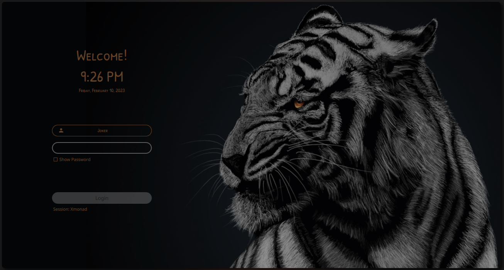
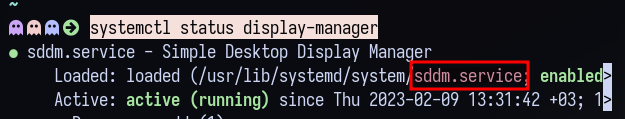
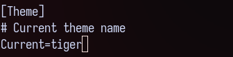

# tiger login theme for SDDM

### Dependencies


**Arch based** distros using the **pacman** package manger:  
*(ArcoLinux/Obarun/Artix/Manjaro/KaOS/Chakra etc.)*  
<pre>sudo pacman -S --needed sddm sddm-kcm</pre> 

**Debian based** distros using the **APT** package manager:  
*(Ubuntu/Kubuntu/Kali/Neon/antiX etc.)*  
<pre>sudo apt install --no-install-recommends sddm sddm-kcm</pre>  
 

**openSUSE** using the **zypper** package manager:  
<pre>sudo zypper install sddm sddm-kcm</pre>  

**Red Hat** based distros using the **dnf** package manager:  
*(Fedora/Mageia/RHEL/CentOS)*  
<pre>sudo dnf install sddm sddm-kcm</pre>  

<br/><br/>


### Instalation
If you have system stting (kde plasma, gnome, xfce, etc ) ArcoLinux, Manjaro, OpenSuse, Kubuntu, go to "System setting" search for  "Login Screen (SDDM)" > "Get New Theme". search for "tiger" and install. sometime under > "Startup and Shutdown" >


**Manual way**

```
git clone https://github.com/al-swaiti/tiger-sddm-theme

cd tiger-sddm-theme

sudo tar -xzvf tiger.tar.gz -C /usr/share/sddm/themes


sudo cp -r /usr/share/sddm/themes/tiger/TTF /usr/share/fonts/ 

fc-cache -f -v

```

First be sure that sddm is your default display manager


```
systemctl status display-manager
```


If you have another display-manager (ex:gdm):
```
sudo systemctl disable gdm.service
```

Then:
```
sudo systemctl enable sddm.service
```

Now you have to set [theme] inside sddm.conf
preferrably at `/etc/sddm.conf.d/default.conf`
sometimes `/etc/sddm.conf.d/kde_settings.conf`
**the name it's not important **
if you didnt find any you can create one by :
```
sudo cp /usr/lib/sddm/sddm.conf.d/default.conf /etc/sddm.conf.d/  
```

Now edit file 
```
sudo nano /etc/sddm.conf.d/default.conf
```
the most important u need to find [Theme] section inside .conf file 
  

In the `[Theme]` section simply add the themes name: `Current=tiger`.
as below


 Also see the [Arch wiki on SDDM](https://wiki.archlinux.org/index.php/SDDM).


 donation on my [PayPayl](https://paypal.me/abdallalswaiti) or [patreon](https://www.patreon.com/user?u=88585798) account for a cup of coffee.  

